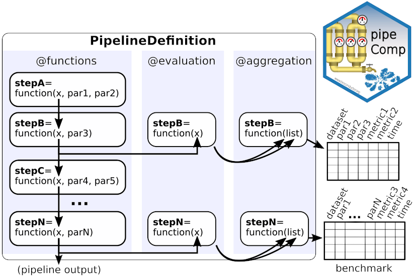
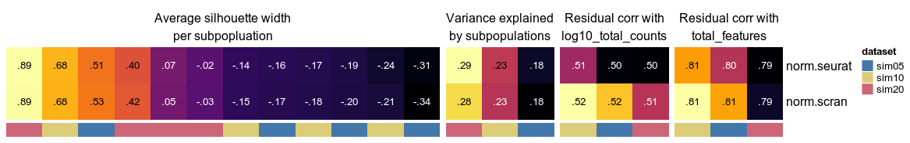
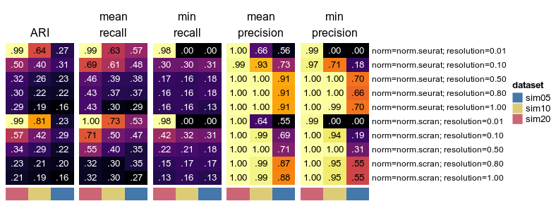
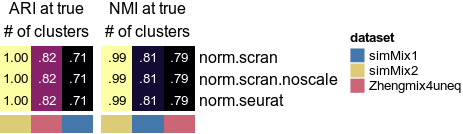

# pipeComp

`pipeComp` is a simple framework to facilitate the comparison of pipelines involving various steps and parameters. Given a `PipelineDefinition`, a set of alternative parameters (which might include different subroutines) and benchmark datasets, the `runPipeline` function proceeds through all combinations arguments, avoiding recomputing the same step twice and compiling evaluations on the fly to avoid storing potentially large intermediate data.

`pipeComp` was initially developed to benchmark single-cell RNA sequencing pipelines:

_pipeComp, a general framework for the evaluation of computational pipelines, reveals performant single-cell RNA-seq preprocessing tools_<br/>
Pierre-Luc Germain, Anthony Sonrel & Mark D Robinson, 
bioRxiv [2020.02.02.930578](https://doi.org/10.1101/2020.02.02.930578)

However the framework can be applied to any other context.

This readme provides an overview of the framework and package. For more detail, please refer to the two vignettes.

* [Recent changes](#recent-changes)
* [Installation](#installation)
* [Using _pipeComp_](#using-pipecomp)
  * [PipelineDefinition](#pipelinedefinition)
  * [Running pipelines](#running-pipelines)
  * [Exploring the metrics](#exploring-the-metrics)
  * [Running a subset of combinations](#running-only-a-subset-of-the-combinations)

<br/><br/>

## Recent changes

`pipeComp` >=0.99.3 made important changes to the format of the output, and greatly simplified the evaluation outputs for the scRNA pipeline. 
As a result, results produced with older version of the package are not anymore compatible with the current version's aggregation and plotting functions.

<br/><br/>

## Installation

Install using:

```{r}
BiocManager::install("plger/pipeComp")
```

Because `pipeComp` was meant as a general pipeline benchmarking framework, we have tried to restrict the package's dependencies to a minimum. 
To use the scRNA-seq pipeline and wrappers, however, requires further packages to be installed. To check whether these dependencies are met for a given `pipelineDefinition` and set of alternatives, see `?checkPipelinePackages`.

<br/><br/>

## Using _pipeComp_



### PipelineDefinition

The `PipelineDefinition` S4 class represents pipelines as, minimally, a set of functions consecutively executed on the output of the previous one, and optionally accompanied by evaluation and aggregation functions. As simple pipeline can be constructed as follows:

```{r}
my_pip <- PipelineDefinition( list( step1=function(x, param1){
                                      # do something with x and param1
                                      x
                                    },
                                    step2=function(x, method1, param2){
                                      get(method1)(x, param2)
                                    },
                                    step3=function(x, param3){
                                      x <- some_fancy_function(x, param3)
                                      # the functions can also output evaluation
                                      # through the `intermediate_return` slot:
                                      e <- my_evaluation_function(x)
                                      list( x=x, intermediate_return=e)
                                    }
                                  ))
```

The PipelineDefinition can also include descriptions of each step or evaluation and aggregation functions. For example:
```{r}
my_pip <- PipelineDefinition( list( step1=function(x, meth1){ get(meth1)(x) },
                                    step2=function(x, meth2){ get(meth2)(x) } ),
                              evaluation=list( step2=function(x){ sum(x) }) )
```


See the `?PipelineDefinition` for more information, or `scrna_pipeline` for a more complex example:

```{r}
pipDef <- scrna_pipeline()
pipDef
```
<pre><code>
A PipelineDefinition object with the following steps:
  - <b>doublet</b>(x, doubletmethod) *
<i>Takes a SCE object with the `phenoid` colData column, passes it through the </i>
<i>function `doubletmethod`, and outputs a filtered SCE.</i>
  - <b>filtering</b>(x, filt) *
<i>Takes a SCE object, passes it through the function `filt`, and outputs a </i>
<i>filtered Seurat object.</i>
  - <b>normalization</b>(x, norm)
<i>Passes the object through function `norm` to return the object with the </i>
<i>normalized and scale data slots filled.</i>
  - <b>selection</b>(x, sel, selnb)
<i>Returns a seurat object with the VariableFeatures filled with `selnb` features </i>
<i>using the function `sel`.</i>
  - <b>dimreduction</b>(x, dr, maxdim) *
<i>Returns a seurat object with the PCA reduction with up to `maxdim` components </i>
<i>using the `dr` function.</i>
  - <b>clustering</b>(x, clustmethod, dims, k, steps, resolution, min.size) *
<i>Uses function `clustmethod` to return a named vector of cell clusters.</i>
</code></pre>

#### Manipulating PipelineDefinition objects

A number of generic methods are implemented on the object, including `show`, `names`, `length`, `[`, `as.list`. This means that, for instance, a step can be removed from a pipeline in the following way:

```{r}
pd2 <- pipDef[-1]
```

Steps can also be added (using the `addPipelineStep` function) and edited - see the `pipeComp` vignette for more detail.

<br/><br/>

### Running pipelines

#### Preparing the other arguments

`runPipeline` requires 3 main arguments: i) the pipelineDefinition, ii) the list of alternative parameters values to try, and iii) the list of benchmark datasets.

The scRNAseq datasets used in the papers can be downloaded from [figshare](https://doi.org/10.6084/m9.figshare.11787210.v1) and prepared in the following way:

```{r}
download.file("https://ndownloader.figshare.com/articles/11787210/versions/1", "datasets.zip")
unzip("datasets.zip", exdir="datasets")
datasets <- list.files("datasets", pattern="SCE\\.rds", full.names=TRUE)
names(datasets) <- sapply(strsplit(basename(datasets),"\\."),FUN=function(x) x[1])
```

Next we prepare the alternative methods and parameters. Functions can be passed as arguments through their name (if they are loaded in the environment):

```{r}
# load alternative functions
source(system.file("extdata", "scrna_alternatives.R", package="pipeComp"))
# we build the list of alternatives
alternatives <- list(
  doubletmethod=c("none"),
  filt=c("filt.lenient"),
  norm=c("norm.seurat", "norm.seuratvst", "norm.scran"),
  sel=c("sel.vst"),
  selnb=2000,
  dr=c("seurat.pca"),
  clustmethod=c("clust.seurat"),
  maxdim=30,
  dims=c(10, 15, 20, 30),
  k=20,
  steps=4,
  resolution=c(0.01, 0.1, 0.2, 0.3, 0.5, 0.8, 1, 1.2, 2),
  min.size=50   
)
```

#### Running the analyses

```{r}
res <- runPipeline( datasets, alternatives, pipDef, nthreads=3,
                    output.prefix="myfolder/" )
```

### Exploring the metrics

Data can be explored manually or plotted using wrapper functions designed for each step at which benchmark data is gathered. For example:

```{r}
scrna_evalPlot_DR(res, scale=FALSE)
```



```{r}
scrna_evalPlot_clust(res, agg.by=c("norm","resolution"))
```



```{r}
scrna_evalPlot_clust(res, what="ARI", atTrueK=TRUE, show_heatmap_legend = FALSE) + 
  scrna_evalPlot_clust(res, atTrueK=TRUE, what="NMI")
```



